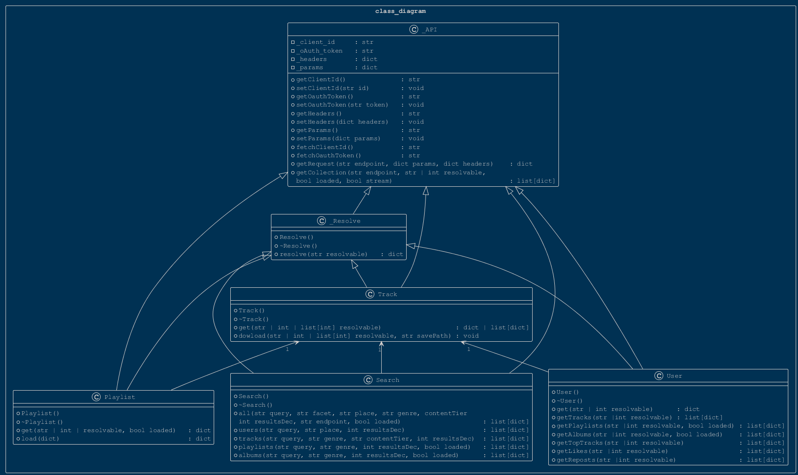
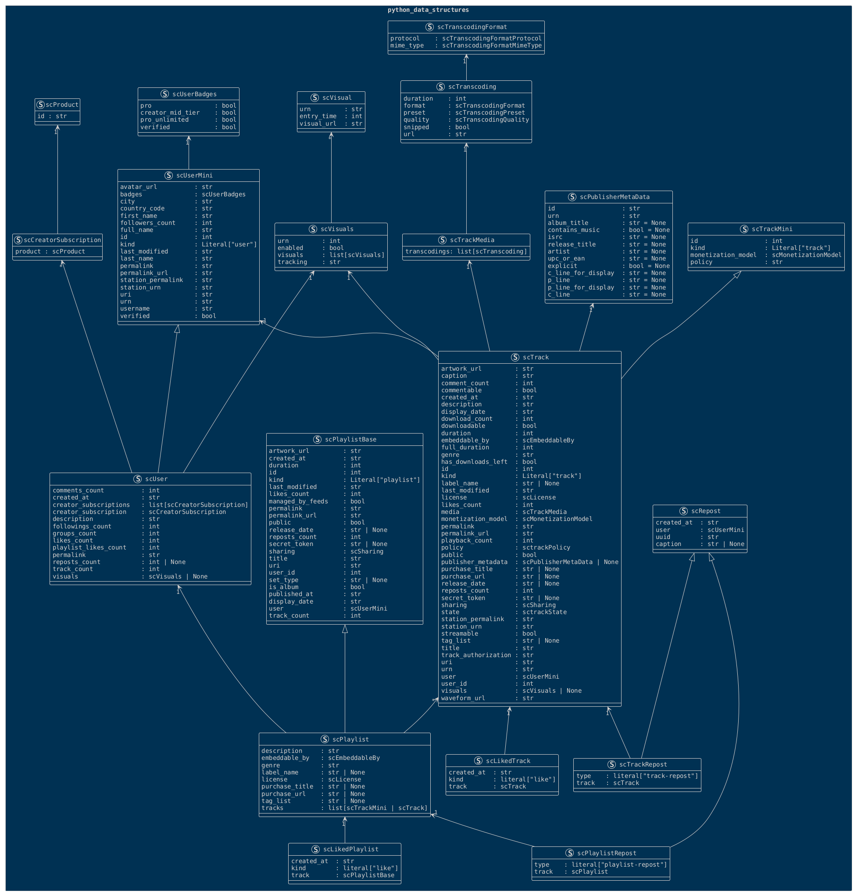

<p align="center">
  
</p>

---

> ## About

Python wrapper for soundcloud API

> ## Examples

```python
from src.classes.Track import Track
from src.classes.Playlist import Playlist
from src.classes.User import User
from src.classes.Search import Search

clientId = "***"
token = "OAuth 2-***"
soundcloudTrack = Track(clientId=clientId, oauthToken=token)
soundcloudPlaylist = Playlist(clientId=clientId, oauthToken=token)
soundcloudUser = User(clientId=clientId, oauthToken=token)
soundcloudSearch = Search(clientId=clientId, oauthToken=token)
```

---
### Resolve
---
each class contains the resolve function. this allows to make requests to the api using strings.


```python
track = soundcloudTrack.resolve("inframusic/spectra-vip")
print(track["id"])
print(track["title"])
```

    1632560757
    INFRA - SPECTRA VIP [FREE DL]
    

---
### tracks
---

tracks can be requested by id or by "user/trackname"


```python
track1 = soundcloudTrack.get(resolvable = 1632560757)
track2 = soundcloudTrack.get(resolvable = "inframusic/spectra-vip")
print(track1["title"])
print(track2["title"])
```

    INFRA - SPECTRA VIP [FREE DL]
    INFRA - SPECTRA VIP [FREE DL]
    

tracks can also be requested using a list of ids


```python
ids = [166022212,189329947,189528155,231375134,243558063,273163647,282616033,311037441]
tracks = soundcloudTrack.get(resolvable = ids)
for track in tracks:
    print(track["title"])
```

    Macky Gee - Black Widow VIP (FREE DOWNLOAD)
    Robert Miles - Children (Macky Gee Chill Out Bootleg) FREE DOWNLOAD
    Macky Gee - Pick 'n' Mix VIP (Free download)
    Macky Gee - Rambunctious VIP (FREE DOWNLOAD)
    Macky Gee - Off One's Rocker VIP (FREE DOWNLOAD)
    Offaiah - Trouble (Macky Gee Bootleg & Chill Remix)- FREE DOWNLOAD
    Macky Gee Feat. Thunda B - Body Strappin (FREE DOWNLOAD)
    Macky Gee - Seduction VIP (FREE DOWNLOAD)
    

if a track has a direct download, the dowload method can be used to download the track


```python
track = soundcloudTrack.get(resolvable = 243558063)
print(track["downloadable"])
soundcloudTrack.download(resolvable = 166022212, savePath="./test")
```

    True
    


    './test/Robert miles - Children (Macky Gee Chill out bootleg) FREE DOWNLOAD.mp3'


---
### Playlist
---

playlists can be requested by id or by "user/sets/playlistname". If the "loaded" argument is set, all information of all tracks in the playlist will be fetched.


```python
playlist1 = soundcloudPlaylist.get(resolvable = "seppe-struye/sets/drum-and-bass-buffer", loaded = True)
playlist2 = soundcloudPlaylist.get(resolvable = 1866218430)
print(playlist1["title"])
print(playlist2["title"])
print("\nLoaded playlist keys:")
print(playlist1["tracks"][-1].keys())
print("\nunloaded playlist keys:")
print(playlist2["tracks"][-1].keys())
```

    FREE DRUM AND BASS
    FREE DRUM AND BASS
    
    Loaded playlist keys:
    dict_keys(['artwork_url', 'caption', 'commentable', 'comment_count', 'created_at', 'description', 'downloadable', 'download_count', 'duration', 'full_duration', 'embeddable_by', 'genre', 'has_downloads_left', 'id', 'kind', 'label_name', 'last_modified', 'license', 'likes_count', 'permalink', 'permalink_url', 'playback_count', 'public', 'publisher_metadata', 'purchase_title', 'purchase_url', 'release_date', 'reposts_count', 'secret_token', 'sharing', 'state', 'streamable', 'tag_list', 'title', 'uri', 'urn', 'user_id', 'visuals', 'waveform_url', 'display_date', 'media', 'station_urn', 'station_permalink', 'track_authorization', 'monetization_model', 'policy', 'user'])
    
    unloaded playlist keys:
    dict_keys(['id', 'kind', 'monetization_model', 'policy'])
    

the load function can be used to load unloaded playlists


```python
playlist2Loaded = soundcloudPlaylist.load(playlist2)
print(playlist2Loaded["tracks"][-1].keys())
```

    dict_keys(['artwork_url', 'caption', 'commentable', 'comment_count', 'created_at', 'description', 'downloadable', 'download_count', 'duration', 'full_duration', 'embeddable_by', 'genre', 'has_downloads_left', 'id', 'kind', 'label_name', 'last_modified', 'license', 'likes_count', 'permalink', 'permalink_url', 'playback_count', 'public', 'publisher_metadata', 'purchase_title', 'purchase_url', 'release_date', 'reposts_count', 'secret_token', 'sharing', 'state', 'streamable', 'tag_list', 'title', 'uri', 'urn', 'user_id', 'visuals', 'waveform_url', 'display_date', 'media', 'station_urn', 'station_permalink', 'track_authorization', 'monetization_model', 'policy', 'user'])
    

---
### User
---

Users can be requested by id or by "username"


```python
user1 = soundcloudUser.get("mackygee")
user2 = soundcloudUser.get(415957)
print(user1["username"])
print(user2["username"])
```

    Macky Gee
    Macky Gee
    

user has some more specific functions


```python
tracks = soundcloudUser.getTracks(415957)
topTracks = soundcloudUser.getTopTracks(415957)
playlists = soundcloudUser.getPlaylists(415957)
albums = soundcloudUser.getAlbums(415957)
likes = soundcloudUser.getLikes(415957)
reposts = soundcloudUser.getReposts(415957)
```

---
### Search
---

"All" can be used to perform a query for all types. the arguments place, genre and contentTier can be used to filter the search query. the resultsDec argument sets how many results (times 10) will be returned. the loaded argument loads playlists.


```python
search = soundcloudSearch.all(query = "test", place = "los angeles", genre = "rock", resultsDec = 1)
print("kinds of results:")
print(list(set([item["kind"] for item in search])))
```

    kinds of results:
    ['track', 'playlist', 'user']
    

some more specific functions in search. users can be filtered by place. tracks, playlists and albums can be filtered by genre. tracks can also be filtered by content tier.


```python
users = soundcloudSearch.users(query = "test", place = "belgium")
tracks = soundcloudSearch.tracks(query = "test", genre = "country")
playlists = soundcloudSearch.playlist(query = "test", genre = "rock")
albums = soundcloudSearch.albums(query = "test", genre = "blues")
```


> ## class diagram

<p align="center">
  
</p>

> ## soundcloud data diagram
>
> <p align="center">
  
</p>
